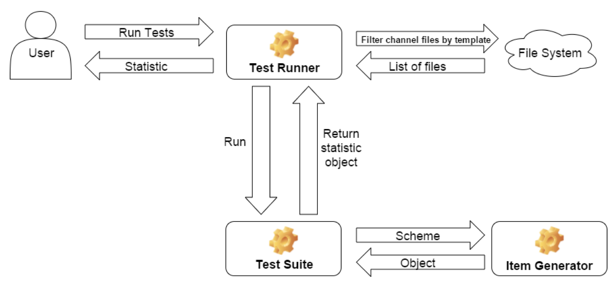
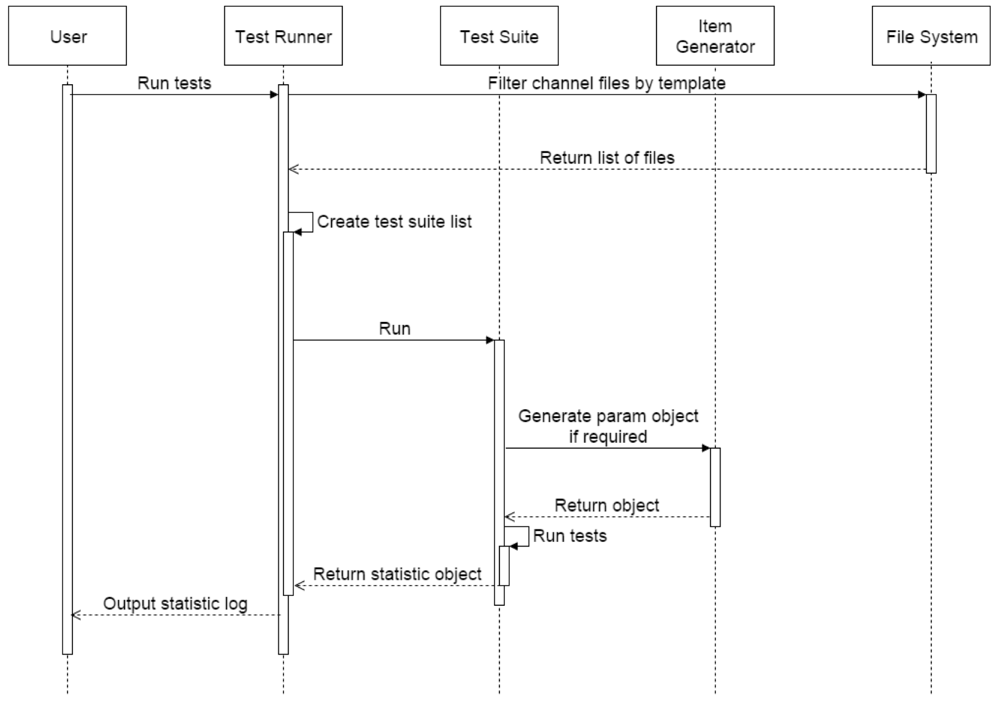
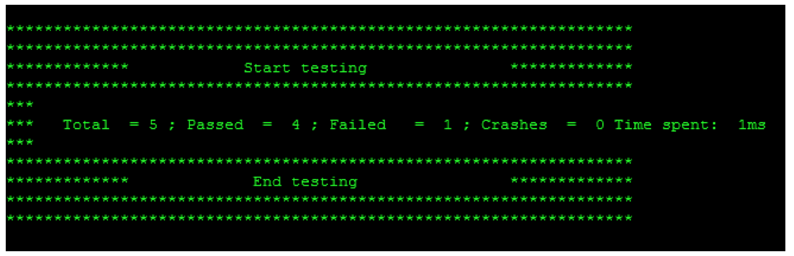
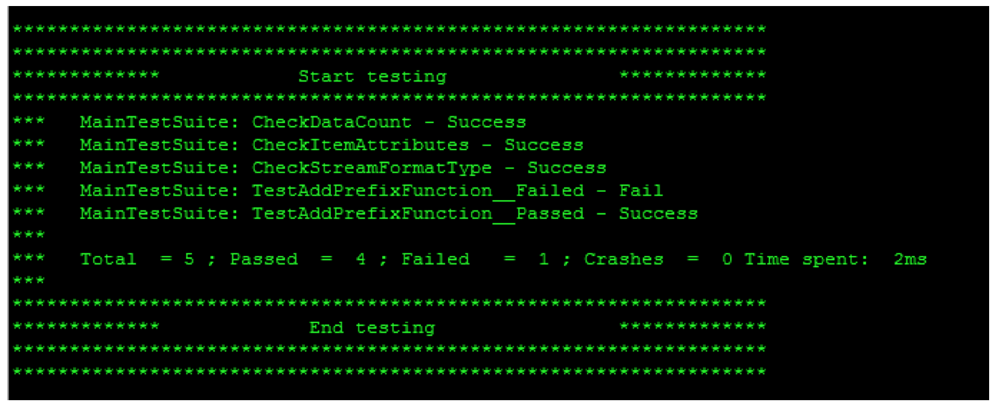
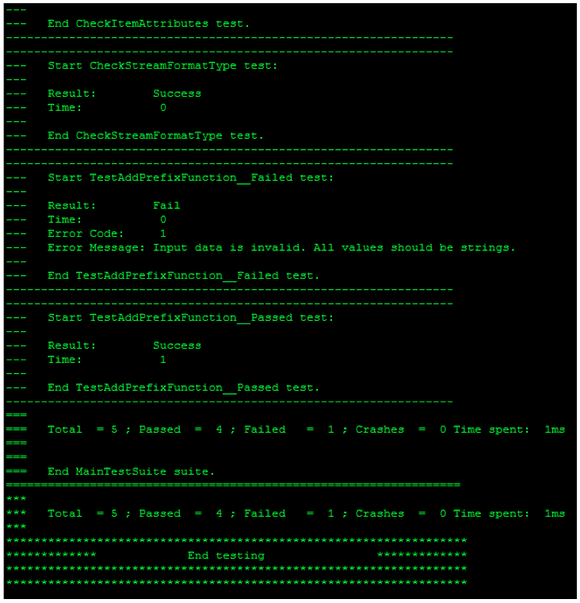

## Overview

This document describes the architecture and usage of the Roku unit test framework.  This framework allows Roku channel developers to instrument their code with predefined or custom test cases in order to unit test their code.

## System Architecture

### System diagram


**Figure 1:** System architecture diagram

### Sequence diagram


**Figure 2:** Flow diagram

## Framework Components

### Test Runner
TestRunner is main object in the unit test framework. This object has 6 properties:
* testsDirectory – path to directory which contains all tests.
* testFilePrefix - string to identify all test files in testsDirectory and subdirectories.
* testSuitePrefix - string identifying all test suites in test files.
* testSuiteName – string identifying specific test suite.
* testCaseName - string identifying specific test case.
* logger – object which formats and outputs logs.

TestRunner searches for .brs files with the testFilePrefix in testsDirectory and subdirectories. When the list of files is complete, TestRunner parses these files and extracts all test suites identified by the prefix testSuitePrefix. Every test suite has a list of test cases. TestRunner compiles a single list of all test cases and then runs them one at a time. Set testSuiteName to specify exact test suite to run or testCaseName to specify exact test case.

During a test run TestRunner collects the statistic into a statistic object. After the test run TestRunner passes a statistics object to a Logger instance which outputs a results to a console accessible via telnet port 8085.  The verbosity level can be set by calling the SetVerbosity method of the Logger instance.

### BaseTestSuite
A collection of one or more test cases is called a test suite.  Developers can implement their own test suite types which must be derived from BaseTestSuite. BaseTestSuite implements a set of assertion methods. All these methods have one common argument “msg”. This is an error message returned if the assertion fails.

**Table 1. Assertions list**

| Method Name        | Arguments           | Description  |
| ------------- |:-------------:| -----:|
| Fail      | msg (string) An error message. Default value: "Error". | Fail immediately, with the given message. |
| AssertFalse      | expr (dynamic) An expression to evaluate.      |   Fail the test if the expression is true. |
| AssertTrue | expr (dynamic) An expression to evaluate.      |    Fail the test if the expression is false. |
| AssertEqual | first (dynamic) A first object to compare. second (dynamic) A second      |    Fail if the two objects are unequal as determined by the '<>' operator. |
| AssertNotEqual | first (dynamic) A first object to compare. second (dynamic) A second object to compare.     |    Fail if the two objects are equal as determined by the '=' operator. |
| AssertInvalid | value (dynamic) A value to check.      |    Fail if the value is not invalid. |
| AssertNotInvalid | value (dynamic) A value to check.      |    Fail if the value is invalid. |
| AssertAAHasKey | array (dynamic) A target array. key (string) A key name.     |  Fail if the array doesn't contain the specified key.   |
| AssertAANotHasKey | array (dynamic) A target array. key (string) A key name.      |    Fail if the array contains the specified key. |
| AssertAAHasKeys | array (dynamic) A target associative array. keys (object) A key names array.     |    Fail if the array doesn't contain the specified set of keys. |
| AssertAANotHasKeys | array (dynamic) A target associative array. keys (object) A key names array.       |    Fail if the array contains the specified set of keys. |
| AssertArrayContains | array (dynamic) A target array. value (dynamic) A value to check. key (object) A key name for associative array.    |    Fail if the array doesn't contain the specified item. |
| AssertArrayNotContains | array (dynamic) A target array. value (dynamic) A value to check. key (object) A key name for associative array.    |    Fail if the array contains the specified item. |
| AssertArrayContainsSubset | array (dynamic) A target array. subset (dynamic) An items array to check.     |    Fail if the array doesn't contains the specified subset of items. |
| AssertArrayNotContainsSubset | array (dynamic) A target array. subset (dynamic) A items array to check.     |    Fail if the array contains the specified subset of items. |
| AssertArrayCount | array (dynamic) A target array. count (integer) An expected array items count.     |    Fail if the array item count is not equal to the specified value. |
| AssertArrayNotCount | array (dynamic) A target array. count (integer) An expected array items count.     |    Fail if the array item count is equal to the specified value. |
| AssertEmpty | item (dynamic) An array or string to check.      |    Fail if the item is not empty. |
| AssertNotEmpty | item (dynamic) An array or string to check.      |    Fail if the item is empty. |
| AssertArrayContainsOnly | array (dynamic) A target array. typeStr (string) An item’s type name.     |    Fail if the array contains items of types other than the specified type. |

### Item Generator

ItemGenerator is an object that generates random items according to a specified scheme.  ItemGenerator is used to create random test data for use as function parameters, etc.  A scheme could be one of simple types (integer, string or float), array or associative array.

For simple types, ItemGenerator generates a random value of this type.

For arrays, the scheme specifies that types of each of the individual array items.

For example:

**scheme:** [“int”, “string”, “string”, “boolean”]

**result:** [5, “ghn56f”, “7sb2td”, true]

An associative array scheme has the following structure:

```
{
       propertyName1: "propertyType1"
       propertyName2: "propertyType2"
       ...
       propertyNameN: "propertyTypeN"
}
```

ItemGenerator will return an associative array object with the specified property names and random values of the specified property types.

For example:

**scheme:**

```
{
    id: "integer"
    name: "string"
    address: {city: “string”, street: “string”}
    active: “boolean”
}
```

**result:**

```
{
    id: 75
    name: "ht7d9nt5zp"
    address: {city : “9gbst5mpw7”, street : “nfdt7ns5p2”}
    active: false
}
```

###	Logger

The Logger object is used to output test results. It takes information from a TestRunner, formats it according to selected verbosity level and outputs to the console. TestRunner calls printStatistic function to print logs. This method has one argument which is a statistic object. The printStatistic function can be overwritten to generate custom log output.

## Usage

To use the unit test framework in your channel, place the framework files in the directory pkg:/source /testFramework/.

To run your unit tests, follow these instruction:

1)	Create new folder “tests” under source directory of your project: “pkg:/source/tests”.
 * This will be the root folder for all your unit tests. In this folder you can also create subfolders for every test suite collection.

2)	Create test suite files in “tests” folder or subfolders.

Create new .brs files for each test suite. The default prefix for test suite files is “Test\__”. You can use any prefix you want just don’t forget to specify it in the next step. In this new file define a function TestSuite__Main().  This function will return the test suite object. Create a new test suite object from BaseTestSuite:

```
_this = BaseTestSuite()_
```

then set its name

```
_this.Name = "MainTestSuite"_
```

Then add test cases:

```
this.addTest("CheckDataCount",TestCase\__Main_CheckDataCount)
```

TestCase\__Main_CheckDataCount is a test function.

```
Function TestCase__Main_CheckDataCount() as String
       return m.assertArrayCount(m.mainData, 15)
End Function
```

3)	Run all your tests.

To run your tests:
* create instance of TestRunner object (Runner = TestRunner()) and call it’s method Run (Runner.Run()). Embrace this code with such if statement – “args.RunTests = "true" and type(TestRunner) = "Function"”.
* If needed set TestRunner’s properties by calling its setter methods before calling Run method.
* Deploy your channel to the device
* POST the following command to the device via ECP:
http://{Roku_box_IP_address}:8060/launch/dev?RunTests=true
* View the test results by opening a telnet console on the device on port 8085:
telnet {Roku box IP address} 8085.

To set verbosity level call Runner.logger.SetVerbosity(level). There are three verbosity levels in this framework:
* “0” – basic level
* “1” – normal level
* “2” – detailed level.

You can overwrite printStatistic if you like, such as

Runner.logger.printStatistic = customPrintFunction

With basic verbosity level the framework outputs total number of tests, number of passed tests, number of failed tests, number of tests that caused a crash and time spent for running the tests:



**Figure 3:** Basic verbosity level

Normal level includes the list of all tests with their names and results:



**Figure 4:** Normal verbosity level


Detailed level shows verbose statistics for every test suite and any error messages for failed tests:



**Figure 5:** Detailed verbosity level

##	Example


Here is an example test suite:

```
'*****************************************************************
'* Copyright Roku 2011-2016
'* All Rights Reserved
'*****************************************************************

' Functions in this file:
'
'     TestSuite__Main
'     MainTestSuite__SetUp
'     MainTestSuite__TearDown
'     TestCase__Main_CheckDataCount
'     TestCase__Main_CheckItemAttributes
'     TestCase__Main_CheckStreamFormatType
'     TestCase__Main_TestAddPrefixFunction__Failed
'     TestCase__Main_TestAddPrefixFunction__Passed

'----------------------------------------------------------------
' Main setup function.
'
' @return A configured TestSuite object.
'----------------------------------------------------------------
Function TestSuite__Main() as Object

    ' Inherite your test suite from BaseTestSuite
    this = BaseTestSuite()

    ' Test suite name for log statistics
    this.Name = "MainTestSuite"

    this.SetUp = MainTestSuite__SetUp
    this.TearDown = MainTestSuite__TearDown

    ' Add tests to suite's tests collection
    this.addTest("CheckDataCount", TestCase__Main_CheckDataCount)
    this.addTest("CheckItemAttributes", TestCase__Main_CheckItemAttributes)
    this.addTest("CheckStreamFormatType", TestCase__Main_CheckStreamFormatType)
    this.addTest("TestAddPrefixFunction__Failed", TestCase__Main_TestAddPrefixFunction__Failed)
    this.addTest("TestAddPrefixFunction__Passed", TestCase__Main_TestAddPrefixFunction__Passed)

    return this
End Function

'----------------------------------------------------------------
' This function called immediately before running tests of current suite.
' This function called to prepare all data for testing.
'----------------------------------------------------------------
Sub MainTestSuite__SetUp()
    ' Target testing object. To avoid the object creation in each test
    ' we create instance of target object here and use it in tests as m.targetTestObject.
    m.mainData  = GetApiArray()
End Sub

'----------------------------------------------------------------
' This function called immediately after running tests of current suite.
' This function called to clean or remove all data for testing.
'----------------------------------------------------------------
Sub MainTestSuite__TearDown()
    ' Remove all the test data
    m.Delete("mainData")
End Sub

'----------------------------------------------------------------
' Check if data has an expected amount of items
'
' @return An empty string if test is success or error message if not.
'----------------------------------------------------------------
Function TestCase__Main_CheckDataCount() as String
    return m.assertArrayCount(m.mainData, 15)
End Function

'----------------------------------------------------------------
' Check if first item has mandatory attributes
'
' @return An empty string if test is success or error message if not.
'----------------------------------------------------------------
Function TestCase__Main_CheckItemAttributes() as String
    firstItem = m.mainData[0]

    mandatoryAttributes = ["url", "title", "hdposterurl"]

    return m.AssertAAHasKeys(firstItem, mandatoryAttributes)
End Function

'----------------------------------------------------------------
' Check if stream format of the item is expected
'
' @return An empty string if test is success or error message if not.
'----------------------------------------------------------------
Function TestCase__Main_CheckStreamFormatType() as String
    firstItem = m.mainData[0]

    return m.assertEqual(firstItem.streamFormat, "mp4")
End Function

'----------------------------------------------------------------
' Generates invalid input object and pass it to function.
'
' @return An empty string if test is success or error message if not.
'----------------------------------------------------------------
Function TestCase__Main_TestAddPrefixFunction__Failed() as String
    'Create scheme for item generator
    scheme = {
        key1  : "integer"
        key2  : "string"
        key3  : "boolean"
        key4  : {subKey1: "string"}
    }
    inputObject = ItemGenerator(scheme)

    'Pass generated item to your function
    result = AddPrefixToAAItems(inputObject)

    return m.assertNotInvalid(result, "Input data is invalid. All values should be strings.")
End Function

'----------------------------------------------------------------
' Generates valid input object and pass it to function.
'
' @return An empty string if test is success or error message if not.
'----------------------------------------------------------------
Function TestCase__Main_TestAddPrefixFunction__Passed() as string
    'Create scheme for item generator
    scheme = {
        key1  : "string"
        key2  : "string"
        key3  : "string"
        key4  : "string"
    }
    inputObject = ItemGenerator(scheme)

    'Pass generated item to your function
    result = AddPrefixToAAItems(inputObject)

    return m.assertNotInvalid(result, "Input data is invalid. All values should be strings.")
End Function```
